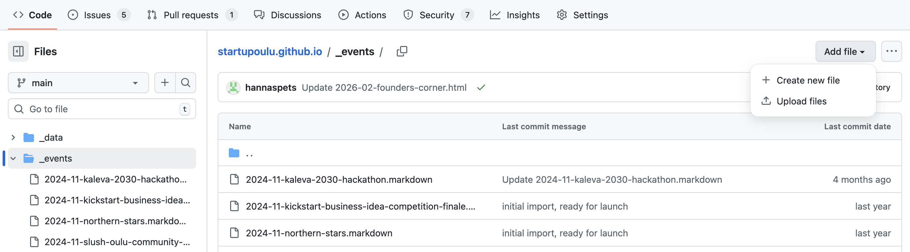
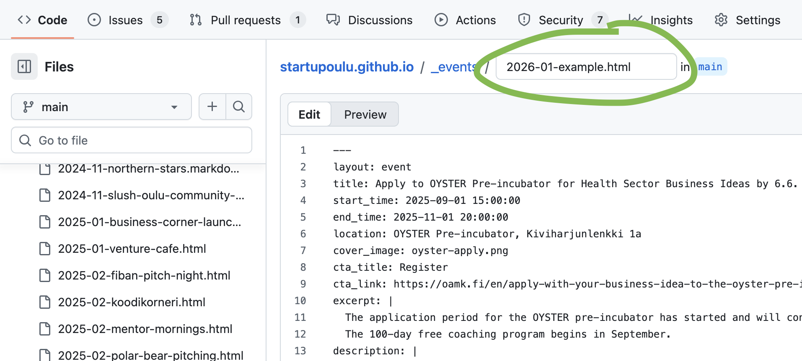
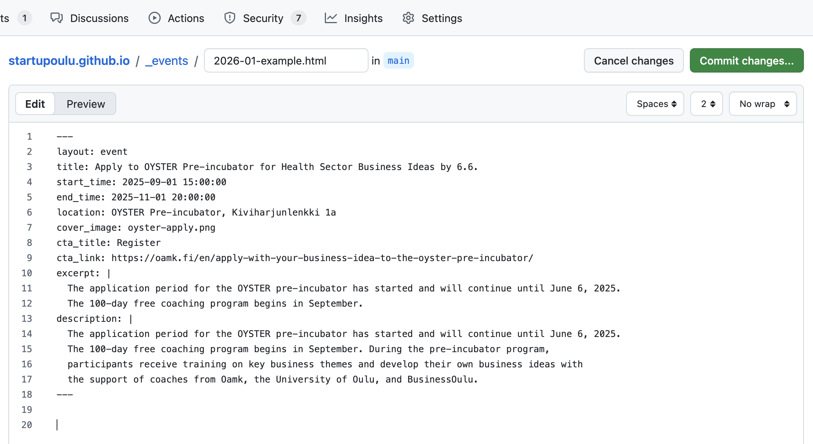
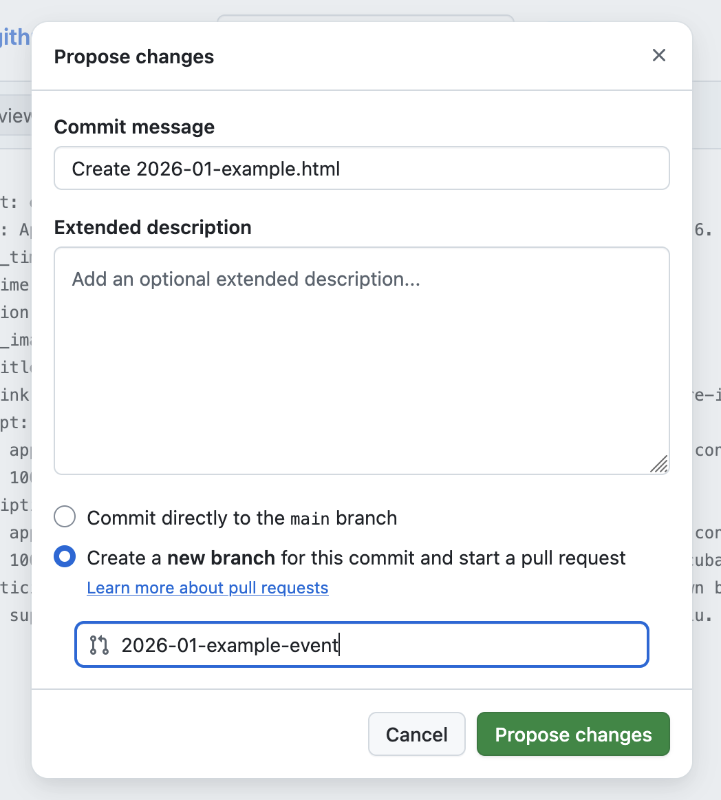

# StartupOulu website

This is the source code for [startupoulu.com](https://www.startupoulu.com). The website is built automatically from the files in this repository. To add or edit content (events, blog posts, services), you edit files here on GitHub. All changes go through a **pull request** — a simple review step where the system checks your changes for errors before they are published to the live site. No coding experience is needed; just follow the guides below.

- [Something not working? How to find and fix errors](#something-not-working-how-to-find-and-fix-errors)
- [File naming rules](#file-naming-rules)
- [How to add an event?](#how-to-add-an-event)
- [How to add a blog post?](#how-to-add-a-blog-post)
- [How to add a service?](#how-to-add-a-service)
- [How to make changes (step-by-step)](#how-to-make-changes)
- [Public Analytics page](https://cloud.umami.is/analytics/eu/share/TRXfirUynZGCZDPq)

## Something not working? How to find and fix errors

Every time you save changes (through a pull request), the system automatically checks your files for common mistakes. If something is wrong, it will tell you exactly what the problem is and how to fix it.

You can always check the status of these checks on the **Actions** page:

### How to check for errors

1. Go to the repository on GitHub
2. Click the **"Actions"** tab at the top of the page (between "Pull requests" and "Projects")
3. You will see a list of recent checks. Each one has a status icon:
   - **Green checkmark** — everything is fine, no errors
   - **Red X** — something went wrong, click on it to see what
4. Click on the failed check (the one with the red X) to open it
5. Click on **"validate"** in the left sidebar
6. Look for the **red error messages** — each one tells you what is wrong and suggests how to fix it

For example, you might see messages like:
- *"Missing closing '---' in front matter. Add a line containing only --- after your last field."*
- *"Missing 'start_time' field. Add 'start_time: 2026-04-22 18:00:00' to the front matter."*
- *"Cover image 'MyImage.png' has uppercase letters. Filenames must be all lowercase."*

### How to fix errors

1. Read the error message carefully — it tells you which file has the problem and what to change
2. Go back to your pull request and click the **"Files changed"** tab
3. Click the **pencil icon** on the file that needs fixing
4. Make the correction based on the error message
5. Click **"Commit changes"** to save — the checks will run again automatically

If you're not sure what went wrong, you can also check the [/debug/](debug) page for an overview of all events and blog posts.

For questions or help, contact information can be found at [startupoulu.com](https://www.startupoulu.com).

---

## Guides

All changes to the website are made through **pull requests** on GitHub. This means your changes are checked for errors before going live. See [How to Make Changes](#how-to-make-changes) for a step-by-step walkthrough of the pull request process.

### File naming rules

All filenames in this project follow the same simple rules:

- **All lowercase** — use `startup-pitch.html`, not `Startup-Pitch.html`
- **Dashes instead of spaces** — use `my-event.html`, not `my event.html`
- **Only one dot in the filename** — the dot goes right before the file extension (`.html`, `.markdown`, `.jpg`). For example: `2026-03-my-event.html`, not `2026-03-my.event.html`
- **No special characters** — stick to letters (a–z), numbers (0–9), and dashes. No underscores, accented letters, or symbols
- **Start with a date** — events use `YYYY-MM-` (e.g., `2026-03-`), blog posts use `YYYY-MM-DD-` (e.g., `2026-03-15-`), and images can optionally start with a date too

| Content type | Format | Example |
|---|---|---|
| Event | `YYYY-MM-slug.html` | `2026-03-startup-pitch.html` |
| Blog post | `YYYY-MM-DD-slug.markdown` | `2026-03-15-building-bridges.markdown` |
| Event image | `descriptive-name.jpg` | `2026-03-startup-pitch.jpg` |
| Blog image | `descriptive-name.jpg` | `2026-03-building-bridges.png` |

### How to add an event?

**Step 1: Prepare your event image**

- Recommended size: 960x540 pixels (16:9 ratio)
- Accepted formats: JPG, PNG
- Use lowercase filenames with dashes instead of spaces
- Example: `2025-03-startup-pitch-night.jpg`

Upload the image to the `assets/images/events/` folder on GitHub.

**Step 2: Create the event file**

Create a new file in the `_events/` folder. The filename **must** follow this format:

```
YYYY-MM-slug.html
```

- Use the event's year and month (zero-padded), followed by a short slug
- Slug must be **lowercase**, use **dashes** instead of spaces, and **no special characters**
- The filename determines the event's URL: `startupoulu.com/events/YYYY-MM-slug.html`

Examples:
- `2025-02-koodikorneri.html`
- `2025-03-polar-bear-pitching.html`
- `2026-02-pbp-express.html`

These won't work:
- `2025-3-My Event.html` — has uppercase letters, spaces, and the month needs a leading zero (`03`)
- `PBP_express.html` — missing the date prefix, and uses an underscore instead of a dash

**Step 3: Add the event content**

Copy this template and fill in your event details:

```yaml
---
layout: event
title: Your Event Title
start_time: 2026-03-15 18:00:00
end_time: 2026-03-15 21:00:00
location: Venue Name, Address
cover_image: your-image-filename.jpg
cta_title: Register
cta_link: https://registration-link.com
excerpt: |
  A brief description of the event (max 60 words). This appears
  on event cards and in previews. Keep it concise and engaging.
description: |
  The full event description. This is displayed on the event page
  as the main content. Use the pipe character (|) followed by
  indented text for multi-line descriptions.
---
```

**Important notes:**
- `description` is **required** — without it the event page will have no content
- `description` must use the `|` (pipe) syntax for multi-line text — indent the text with two spaces below it
- `start_time` is **required** — events without it will not appear on the events page or homepage
- `start_time` and `end_time` format: `YYYY-MM-DD HH:MM:SS`
- `cover_image` is just the filename (the path is added automatically). If omitted, a default placeholder image is shown
- `excerpt` is truncated at 60 words — if not provided, `description` is used instead
- `cta_title` and `cta_link` are optional — if omitted, no button is shown on the event page
- To hide an event from the website without deleting the file, add `published: false` to the front matter. The event will be excluded from the build entirely

---

### How to add a blog post?

**Step 1: Prepare your blog image**

- Recommended size: 960x540 pixels (16:9 ratio)
- Accepted formats: JPG, PNG
- Use lowercase filenames with dashes

Upload the image to `assets/images/blogs/` folder.

**Step 2: Create the blog post file**

Create a new file in the `_posts/` folder. The filename must follow this format:

```
YYYY-MM-DD-slug.markdown
```

Examples:
- `2025-03-15-startup-ecosystem-update.markdown`
- `2025-04-01-how-to-pitch-your-idea.markdown`

**Step 3: Add the blog content**

Copy this template and fill in your post details:

```yaml
---
layout: blog
title: Your Blog Post Title
description: A brief meta description for search engines and social media sharing (1-2 sentences).
blog_image: /assets/images/blogs/your-image-filename.jpg
---

Your blog content goes here. You can use **Markdown formatting**.

## Subheadings

Use ## for main sections and ### for subsections.

- Bullet points work
- Like this

You can also include [links](https://example.com) and *italic text*.
```

**Important notes:**
- `blog_image` requires the full path starting with `/assets/images/blogs/`
- `description` is used for SEO and social media previews
- Content is written in Markdown format
- The publication date comes from the filename
- To hide a blog post from the website without deleting the file, add `published: false` to the front matter. The post will be excluded from the build entirely

---

### How to add a service?

Services are ecosystem partners displayed on the Services page. They are defined in `_data/services.yaml`.

**Step 1: Open the services file**

Edit `_data/services.yaml`

**Step 2: Add your service**

Add a new entry at the end of the file:

```yaml
- title: Service Name
  description: A brief description of what this service offers to entrepreneurs.
  link_label: Learn More
  link_url: https://service-website.com
  stage:
    - just-exploring
    - getting-started
    - ready-to-grow
```

**Stage options:**
- `just-exploring` - For people exploring entrepreneurship
- `getting-started` - For early-stage startups
- `ready-to-grow` - For growth-stage companies

A service can belong to multiple stages.

---

## Site Structure

### Events

Events are defined in the `_events/` directory. Each event has its own file.

The filenames must follow the naming convention: `YYYY-MM-slug.html`

Full event template with all fields:

```yaml
---
layout: event
title: Apply to OYSTER Pre-incubator for Health Sector Business Ideas by 6.6.
start_time: 2025-09-01 15:00:00
end_time: 2025-11-01 20:00:00
location: OYSTER Pre-incubator, Kiviharjunlenkki 1a
cover_image: oyster-apply.png
cta_title: Register
cta_link: https://oamk.fi/en/apply-with-your-business-idea-to-the-oyster-pre-incubator/
excerpt: |
  The application period for the OYSTER pre-incubator has started and will continue until June 6, 2025.
  The 100-day free coaching program begins in September.
description: |
  The application period for the OYSTER pre-incubator has started and will continue until June 6, 2025.
  The 100-day free coaching program begins in September. During the pre-incubator program,
  participants receive training on key business themes and develop their own business ideas with
  the support of coaches from Oamk, the University of Oulu, and BusinessOulu.
---
```

### Blog Posts

Blog posts are defined in the `_posts/` directory using Markdown format.

### Services

Services are defined in `_data/services.yaml` using YAML format.

Example with two services:

```yaml
- title: Founder's Corner
  stage:
    - just-exploring
    - getting-started
    - ready-to-grow
  description: Build digital business with guidance and earn your first euros!
  link_label: Open
  link_url: https://example.com

- title: Business Corner
  stage:
    - just-exploring
    - getting-started
  description: Student entrepreneurship hub at Linnanmaa campus
  link_label: Learn More
  link_url: https://example.com
```

---

## Images

All images must be uploaded under `assets/images/` directory.

| Content Type | Location | Recommended Size |
|-------------|----------|------------------|
| Event covers | `assets/images/events/` | 960x540 px |
| Blog images | `assets/images/blogs/` | 960x540 px |

**Image requirements:**
- Formats: JPG, PNG
- Filenames: lowercase only, no spaces (use dashes)
- Aspect ratio: 16:9 recommended

**Filename examples:**
- Good: `2025-03-startup-pitch-night.jpg`
- Bad: `Startup Pitch Night.JPG`

### Directory structure

```
assets/
└── images/
    ├── events/    # Event cover images
    ├── blogs/     # Blog post images
    └── contacts/  # Team member photos
```

---

## How to Make Changes

All changes go through **pull requests**. This means you propose your changes first, the system checks them for errors, and then you publish them. This prevents mistakes from reaching the live website.

> **What is a pull request?** Think of it like a draft. Instead of changing the website directly, you save your changes to a separate draft. The system automatically checks the draft for errors (like missing fields or typos in the formatting). If everything looks good, you click a button to publish the draft to the live site. If there are errors, you can fix them before anything goes live.

### Option 1: GitHub Web Interface

#### Step 1: Upload your image first (if needed)

If your event or blog post has an image, upload it first. You'll create a pull request for the image, merge it, and then create another pull request for the content file.

1. Go to the repository on GitHub
2. Navigate to the correct image folder:
   - For events: `assets/images/events/`
   - For blog posts: `assets/images/blogs/`
3. Click **"Add file"** > **"Upload files"**
4. Drag your image file into the upload area, or click "choose your files" to browse
5. At the bottom of the page, select **"Create a new branch for this commit and start a pull request"**
6. Give the branch a name like `add-event-image` and click **"Propose changes"**
7. On the next page, click **"Create pull request"**, wait for the green checkmark, then click **"Merge pull request"** > **"Confirm merge"**

#### Step 2: Create your content file

1. Navigate to the appropriate folder (`_events/` for events, `_posts/` for blog posts)



2. Click **"Add file"** > **"Create new file"**
3. In the filename field at the top, type your filename following the naming rules above (e.g., `2026-03-my-event.html`)



4. In the large text area below, paste your content (copy a template from the guides above)

#### Step 3: Save your changes as a pull request

This is the key part — instead of publishing directly, you'll create a pull request so the system can check your work first.

5. Click the green **"Commit changes..."** button in the top right



6. A dialog box will appear. Look for the two radio button options near the bottom:
   - "Commit directly to the `main` branch" — skip this one
   - **"Create a new branch for this commit and start a pull request"** — **select this one**

7. You'll see a text field for the branch name. Type a short name that describes your change, for example:
   - `add-march-pitch-event`
   - `add-blog-post-arctic`
   - `update-event-date`

   (Use only lowercase letters, numbers, and dashes. No spaces.)



8. Click **"Propose changes"**

#### Step 4: Open the pull request

You'll be taken to a new page titled **"Open a pull request"**.

9. The **title** field will be pre-filled. You can keep it or write something more descriptive (e.g., "Add March pitch event")
10. The description field is optional — you can leave it empty or add a note for your team
11. Click the green **"Create pull request"** button

#### Step 5: Wait for the automatic check

After creating the pull request, the system will automatically check your content. This takes about 1–2 minutes. You'll see the status at the bottom of the pull request page:

- **Yellow circle** — checks are still running, wait a moment
- **Green checkmark** with "All checks have passed" — everything looks good, you can proceed to Step 6
- **Red X** with "Some checks were not successful" — there's an error that needs fixing (see below)

#### Step 6: Publish your changes

Once you see the green checkmark:

12. Scroll down to the bottom of the pull request page
13. Click the green **"Merge pull request"** button
14. Click **"Confirm merge"**

Your changes are now live! The website will update within a few minutes.

15. You'll see an option to **"Delete branch"** — click it to clean up (this is optional but keeps things tidy)

#### If the check fails (red X)

Don't worry — nothing has been published, and you can fix the error right from GitHub. See [Something not working? How to find and fix errors](#something-not-working-how-to-find-and-fix-errors) for detailed step-by-step instructions on how to find and fix the problem.

### Option 2: Local Development

1. Clone the repository
2. Create a new branch: `git checkout -b my-change`
3. Make your changes locally
4. Commit and push: `git push -u origin my-change`
5. Open a pull request on GitHub

Using a pull request is recommended so that changes are validated before going live.

---

## Technical Details

This site is built using [Jekyll](https://jekyllrb.com/) and hosted on [GitHub Pages](https://docs.github.com/en/pages).

### Local Development Setup

To run the site locally, you need Ruby installed. We recommend using a version manager:
- [Rbenv](https://github.com/rbenv/rbenv)
- [asdf](https://github.com/asdf-vm/asdf-ruby)
- [mise](https://github.com/jdx/mise)

Then run:

```bash
bundle install
bundle exec jekyll serve
```

The site will be available at `http://localhost:4000`.

### Verifying Changes

To check that your changes don't break the build:

```bash
bundle exec jekyll build
```

If this completes without errors, your changes are safe to commit.
